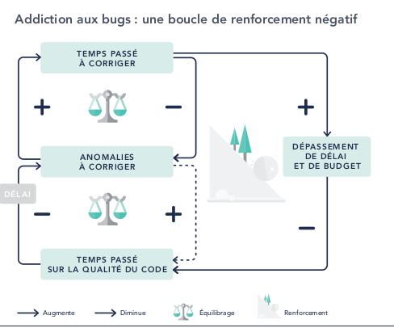

# Why/What/How

Je propose de mettre en miroir chaque problème avec une ou plusieurs solutions.

Quel est le but de la tribu (plus-value) ?
- soit explorer le problème et élaborer une solution "custom" ;
- soit consulter notre catalogue et appliquer une solution déjà connue.

Une boite à outils

Des patterns

Supprimer le terme solutions et la remplacer par outils.

On ne peut pas savoir ce qui résoudra le problème, mais on a a disposition des outils.
En essayant ces outils, on apprendra toujours quelque chose sur le problème. Et à la fin, on trouvera la solution.
Exploration.

On n'est pas dans le solutionnisme des éditeurs de logiciels, qui proposent une même réponse à des problèmes (besoins) différents. 

Problématique = différents aspects à traiter

Problème : vision simpliste
- jugement moral
- inattendu 
- de mauvais (= trouble)
- imputable à une seule cause (mono-causale), extérieure ou mono-personnelle ( = une maladie infectieuse, alors que celle-ci est dûe à un affaiblissement de l'organisme par mauvaise alimentation, exercice physique, contact social)
- qui n'arrive pas aux autres, ni à nous en général
- et donc qui peut être évité 

Or ce n'est que la conséquence logique d'un système qui a vécu, et tout le monde en fait l'expérience.
C'est notre travail normal, pas un problème.

Est-ce une fatalité ?

Est-ce que la vision caricaturale nous apporte quelque chose ?

Symptôme, douleur = les constantes physiologiques dérivent lentement depuis longtemps, mais là elles passent en-dessous du seuil "normal" - c'est facile de voir que la tension est critique (= trop de bugs), mais personne n'a vu que ça fait 3 ans que ça baisse. 

Est-ce qu'on est médecin urgentiste (ajouter des dev ou fixer les bugs) ou est-ce qu'on fait de la prévention (refacto du code, ou changer la prise en compte du besoin) ?

Donc, on ne va pas vendre une solution miracle à un "problème mono-causal", mais on va considérer le système pour stabiliser l'état du patient et inverser une tendance. 

Plusieurs cas :
- le client nous sollicite alors que son application va bien : on fait de la prévention (est-ce dans les clients de la tribu ? si oui, on peut proposer des audits)
- le client nous sollicite alors que son application va mal (ex: TTM passe de 1 semaine à 3 mois) : on aide à stabiliser (reste à 3 mois), puis on inverse la tendance (3 mois à 2 mois)
- le client vient son problème et sa solution et veut staffer des octo, et nous on veut explorer le problème et non pas appliquer une potentielle mauvaise solution

Le "besoin" client, vu par le client :
- persister en BDD;
- faire un batch;
- transformation agile;
- un framework maison;
- faire une refonte;
- 
- utiliser un système à base de règles.

une question = une réponse = vision moraliste du management = G. Weinberg 

refonte applicative : or = règles de gestion, on change la forme, on garde le fond

[Philosophie du problème](Philosophie du problème

SICP

Every computer program is a model, hatched in the mind, of a real or mental process. These processes, arising from human experience and thought, are huge in number, intricate in detail, and at any time only partially understood. They are modeled to our permanent satisfaction rarely by our computer program. Thus even though our programs are carefully handcrafted discrete collections of symbols, mosaics of interlocking functions, they continually evolve: we change them as our perception of the model deepens, enlarges, generalizes until the model ultimately attains a metastable place within still another model with which we struggle. The source of the exhilaration associated with computer programming is the continual unfolding within the mind and on the computer of mechanisms expressed as programs and the explosion of perception they generate.)

[SICP](https://web.mit.edu/6.001/6.037/sicp.pdf)

> Every computer program is a model, hatched in the mind, of a real or mental process. These processes, arising from human experience and thought, are huge in number, intricate in detail, and at any time only partially understood. They are modeled to our permanent satisfaction rarely by our computer program. Thus even though our programs are carefully handcrafted discrete collections of symbols, mosaics of interlocking functions, they continually evolve: we change them as our perception of the model deepens, enlarges, generalizes until the model ultimately attains a metastable place within still another model with which we struggle. The source of the exhilaration associated with computer programming is the continual unfolding within the mind and on the computer of mechanisms expressed as programs and the explosion of perception they generate.